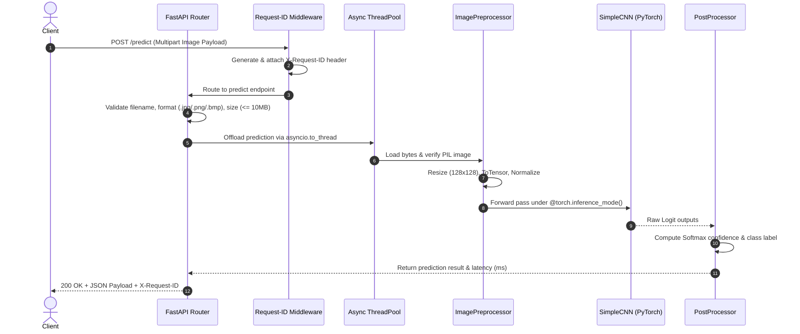

# 🚀 Production MLOps & CI/CD Image Classification Pipeline

[](https://www.python.org/)
[](https://pytorch.org/)
[](https://fastapi.tiangolo.com/)
[](https://mlflow.org/)
[](https://www.docker.com/)
[](https://github.com/psf/black)

A production-grade, end-to-end Machine Learning pipeline and serving system for **Cat vs. Dog Image Classification**. Built with **PyTorch**, **FastAPI**, **MLflow**, **Docker**, and **GitHub Actions CI/CD**.

---

## 🏗️ Flow Architecture

### 1. Overall System Architecture


---

### 2. Request & Inference Sequence Flow



---

## 📂 Project Structure

```
.
├── .github/
│   └── workflows/
│       └── deploy.yml          # GitHub Actions CI/CD Pipeline
├── api/
│   ├── app.py                  # FastAPI application entry point & lifespan singleton
│   ├── routes.py               # REST API endpoints (/, /health, /version, /predict)
│   └── schemas.py              # Pydantic request/response schemas
├── configs/
│   ├── config.yaml             # Main training & model hyperparameters
│   ├── settings.py             # Centralized application settings (Pydantic BaseSettings)
│   └── smoke_train.yaml        # Fast training config for CI smoke testing
├── dataset/                    # Training, validation & test dataset directories
├── inference/
│   ├── model_loader.py         # PyTorch checkpoint model loader
│   ├── postprocess.py          # Logits to class probability conversion
│   ├── predictor.py            # High-level inference pipeline
│   └── preprocess.py           # Image decoding & transformation pipeline
├── models/
│   ├── cnn.py                  # SimpleCNN model architecture
│   └── layers.py               # Reusable ConvBlock module
├── registry/
│   └── model_registry.py       # MLflow Model Registry stage manager
├── tests/
│   ├── test_api.py             # Integration tests for FastAPI endpoints
│   ├── test_checkpoint.py      # Tests for model checkpoint saving/loading
│   ├── test_dataset.py         # Tests for dataset splitting & transformations
│   ├── test_evaluate.py       # Tests for evaluation metrics calculation
│   ├── test_model.py           # Tests for neural network architecture
│   └── test_train.py           # Tests for training loop updates
├── training/
│   ├── dataset.py              # PyTorch Dataset & DataLoader utilities
│   ├── evaluate.py             # Model evaluation module
│   ├── loss.py                 # Loss function setup
│   └── train.py                # Comprehensive training script
├── utils/
│   └── mlflow_logger.py        # MLflow experiment tracking wrapper
├── Dockerfile                  # Production non-root Docker build specification
├── docker-compose.yml          # Local container orchestration
├── pytest.ini                  # Pytest configuration
└── requirements.txt            # Project dependencies
```

---

## 🛠️ Tech Stack

* **Deep Learning Framework**: PyTorch, Torchvision
* **API Service**: FastAPI, Uvicorn, Pydantic (v2), Starlette
* **MLOps & Tracking**: MLflow
* **Code Quality & Testing**: Pytest, Ruff, Black
* **Containerization & CI/CD**: Docker, GitHub Actions, Render Cloud

---

## ⚡ Quickstart Guide

### 1. Environment Setup

```bash
# Create a virtual environment
python -m venv .venv

# Activate virtual environment
# Windows:
.venv\Scripts\activate
# Linux/macOS:
source .venv/bin/activate

# Install dependencies
pip install -r requirements.txt
```

### 2. Train the Model

```bash
# Run training pipeline with default configuration
python -m training.train --config configs/config.yaml

# Run fast smoke test training
python -m training.train --config configs/smoke_train.yaml
```

### 3. Launch MLflow UI

```bash
mlflow ui --backend-store-uri sqlite:///mlflow.db
```

### 4. Run the FastAPI Production Server

```bash
# Run locally with Uvicorn
python -m uvicorn api.app:app --host 0.0.0.0 --port 8000 --reload
```

Interactive API documentation will be available at:
* **Swagger UI**: `http://localhost:8000/docs`
* **ReDoc**: `http://localhost:8000/redoc`

---

## 🧪 Testing & Quality Assurance

Run the automated test suite and static code checks:

```bash
# Run full pytest suite (68 tests)
pytest -v

# Run code linter
ruff check .

# Check code formatting
black --check .
```

---

## 🐳 Docker Deployment

### Local Docker Build & Run

```bash
# Build the production Docker image
docker build -t image-classification-api:latest .

# Run container on port 8000
docker run -p 8000:8000 image-classification-api:latest
```

---

## 🔑 Production Hardening Features

1. **Non-blocking Event Loop**: Asynchronous threadpool execution (`asyncio.to_thread`) for image transformations and model forward passes prevents endpoint blocking.
2. **Predictor Singleton**: Pre-loads PyTorch weights into memory during FastAPI `lifespan` startup, ensuring ultra-low first-request latency.
3. **Payload Protection**: Strict 10MB payload size limits and byte verification (`image.verify()`) protect against DoS attacks and corrupted files.
4. **Observability**: Automatic `X-Request-ID` tracing header propagation across logs and response headers.
5. **Container Security**: Dockerfile executes under a dedicated non-root user (`appuser:appuser`).
